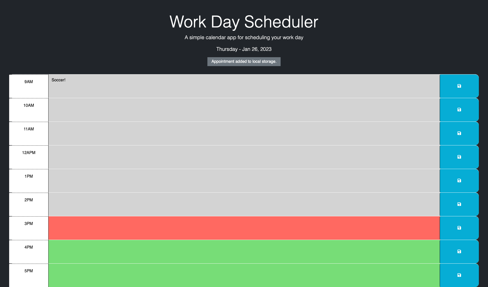

# Work Day Scheduler

# User Story
* As an employee with a busy schedule, I want to add important events to a daily planner so I can manage my time effectively

# Description
* This is a work day scheduler.  It uses the web API's localStorage object to store calendar events so that the user can close and reopen the browser.

* This project uses Day JS, Jquery, bootstrap v5.3 and Google Font
* Enjoy!

# Screenshot

# Live Site
* https://johnxlai.github.io/work-day-scheduler
